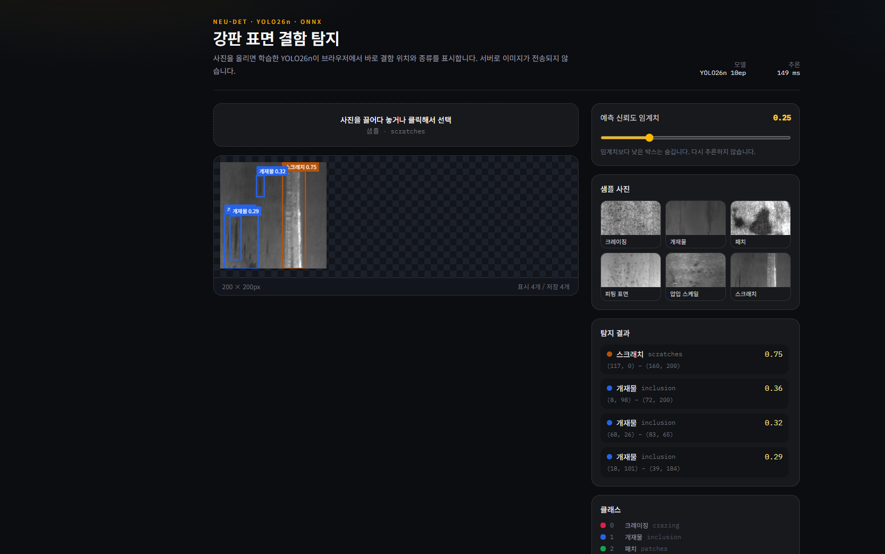
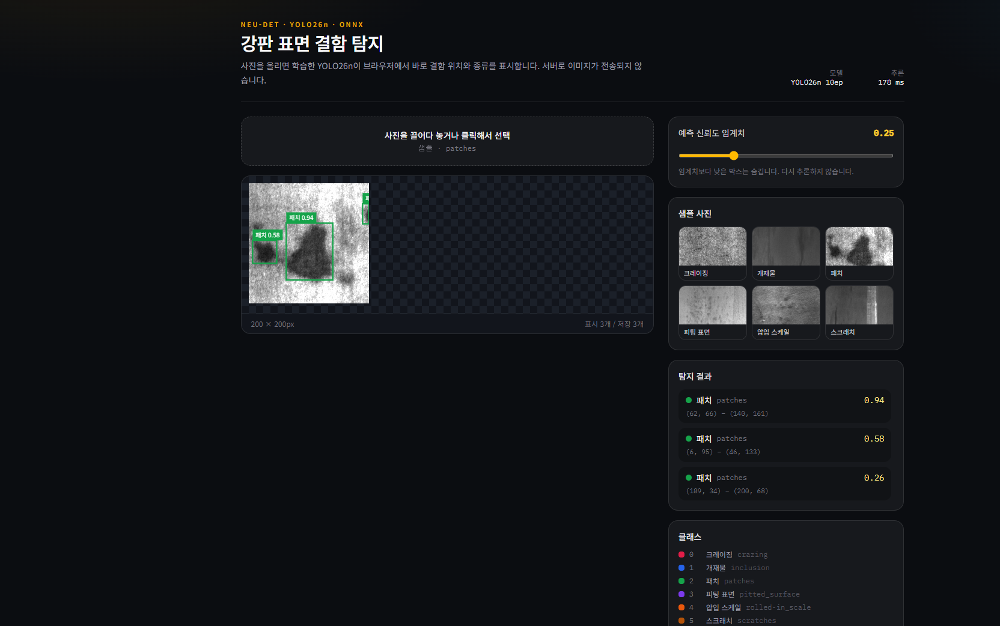

# 🏭 제조 현장 표면 결함 탐지 — YOLO26n 딥러닝 검사기

강판·금속 같은 **일반 제조 라인의 육안 검사**를 딥러닝으로 옮긴 프로그램입니다.
공개 데이터 NEU-DET로 **결함이 어디에, 어떤 종류로 있는지**를 학습한 뒤,
사진을 올리면 브라우저가 바로 박스와 클래스 이름을 그려 줍니다.

분류(이 사진이 불량인가)가 아니라 **탐지(어디에 무슨 결함이 있는가)** 입니다.
한 장에 스크래치와 개재물이 같이 있어도 각각 위치를 짚습니다.
이미지는 서버로 나가지 않고, 변환한 ONNX 가중치가 브라우저에서 추론합니다.

**라이브 데모:** [https://neu-det-yolo26n-web.vercel.app](https://neu-det-yolo26n-web.vercel.app)

## 실행 화면

**① 스크래치 샘플** — 한 장에서 스크래치와 개재물을 동시에 찾고, 좌표·신뢰도를 옆에 나열


**② 패치 샘플** — 신뢰도 0.94까지 올라가는 표면 패치를 박스로 표시


현장 검사원이 하는 일은 “이 표면을 보고 흠집을 찾아 종류를 적는 것”입니다.
이 화면은 그 작업을 모델이 초안으로 먼저 수행한 결과입니다.

## 1. Overview

- **현장 문제**: 육안 검사는 사람마다 기준이 다르고, 피로가 쌓이면 잔흠을 놓칩니다. 결함은 한 종류만 나오지 않습니다.
- **이 프로그램이 하는 일**: 사진을 받아 결함 **위치(박스)** 와 **종류(6클래스)** 와 **확신도**를 같이 보여 줍니다.
- **왜 딥러닝인가**: 스크래치·개재물·스케일은 규칙 기반으로 자르기 어렵습니다. 같은 “선”이라도 압연 자국과 스크래치는 결이 다릅니다. 객체 탐지 모델이 그 모양을 예시로 배웁니다.
- **핵심 원칙**: 시험(test) 사진은 학습·튜닝에 쓰지 않았습니다. 지표와 화면 검증은 검증(val)만 사용했습니다.

| 목표 | 내용 |
|---|---|
| Daily | 라인에서 찍은 사진을 올리면, 결함 위치와 종류를 수 초 안에 확인 |
| Demo | GPU 서버 없이 브라우저만으로 품질·공정 담당자에게 검사 흐름을 보여 줌 |
| Next | 실제 공장 카메라·자체 결함 정의가 생기면 같은 파이프라인으로 재학습 |

## 2. Technical Stack

| 구분 | 구성 |
|---|---|
| **학습** | YOLO26n (`yolo26n.pt` 사전학습 → NEU-DET 6클래스 파인튜닝), Ultralytics 8.4, PyTorch, CUDA |
| **데이터** | NEU-DET, YOLO 형식 (`train 1260 / val 270 / test 270`) |
| **학습 설정** | 10 epoch, imgsz 640, batch 32, seed 42, mosaic 후반 2 epoch off |
| **내보내기** | `best.pt` → ONNX (NMS 포함, 입력 `1×3×640×640`, 출력 `1×300×6`) |
| **추론 UI** | Next.js 16, TypeScript, onnxruntime-web (WASM) |
| **배포** | Vercel, 모델은 `public/models/best.onnx` |

```
사진
  → letterbox 640 (회색 114 패딩, YOLO 전처리)
  → ONNX YOLO26n
  → (x1, y1, x2, y2, score, class) × 최대 300
  → 원본 해상도 좌표로 되돌림
  → 화면 박스 + 한글 클래스
```

## 3. 제조 현장에서 이 구조가 도움이 되는 이유

육안 검사를 카메라로 바꾸려면 “불량/양품” 한 줄만으로는 부족합니다.
조치 담당자는 **어디를 재작업할지, 어떤 불량 유형인지**가 필요합니다.

| 현장 질문 | 이 프로그램의 답 |
|---|---|
| 이 표면에 흠이 있나? | 신뢰도 임계치 이상의 박스가 있으면 있다 |
| 어디를 보면 되나? | 픽셀 좌표 박스 |
| 무슨 흠인가? | 크레이징 / 개재물 / 패치 / 피팅 / 압입 스케일 / 스크래치 |
| 얼마나 확신하나? | 박스마다 score, 슬라이더로 현장 기준에 맞춤 |
| 사진을 외부 서버에 올려도 되나? | 브라우저 로컬 추론이라 업로드하지 않음 |

같은 파이프라인은 강판만이 아닙니다.
사출 외관, 도장 면, 용접 비드, 필름 스크래치처럼 **2D 사진으로 보는 표면 품질**이면
클래스 이름과 사진만 바꾸면 동일한 “찍는다 → 찾는다 → 종류를 적는다” 흐름이 됩니다.

## 4. 데이터와 클래스

NEU-DET는 동북대학교에서 공개한 **열연 강판 표면 결함** 데이터입니다.
원본은 200×200 흑백에 가깝고, 학습 때는 640으로 키워 넣었습니다.
파일명 클래스와 XML 박스 클래스가 다른 장이 있어, **파일명이 아니라 박스 라벨**을 정답으로 썼습니다.

| ID | 영문 | 한글 | 현장에서 보는 느낌 |
|---|---|---|---|
| 0 | crazing | 크레이징 | 그물처럼 갈라진 표면 균열 |
| 1 | inclusion | 개재물 | 이물질이 박힌 점·줄 |
| 2 | patches | 패치 | 얼룩·색 번짐 덩어리 |
| 3 | pitted_surface | 피팅 표면 | 작은 구멍·패임이 퍼진 면 |
| 4 | rolled-in_scale | 압입 스케일 | 스케일이 압연에 밀려 들어간 자국 |
| 5 | scratches | 스크래치 | 직선에 가까운 긁힘 |

## 5. 학습 결과 (검증 세트)

10 epoch는 긴 학습이 아니라 **파이프라인이 현장에서 쓸 수 있는 형태까지 가는지**를 확인한 짧은 학습입니다.
시험 세트는 열지 않았습니다.

| 지표 | 값 (val, 마지막 epoch) |
|---|---|
| Precision | 0.692 |
| Recall | 0.690 |
| mAP50 | **0.742** |
| mAP50-95 | 0.397 |
| GPU | RTX 5060 Ti, 약 6.6분 |

mAP50은 “대충 위치만 맞아도 맞다”에 가깝고, mAP50-95는 박스 경계를 더 엄격히 봅니다.
10 epoch 기준으로는 위치를 찾는 능력은 쓸 만하고, 박스를 꼭 맞게 조이는 능력은 아직 부족합니다.
크레이징처럼 얇고 넓은 결함은 같은 임계치에서 잘 안 잡히는 경우도 있습니다.

## 6. 파일 구성

이 저장소는 **학습이 끝난 모델을 현장 데모로 만든 제품**입니다.

| 파일 / 폴더 | 무엇을 하는가 |
|---|---|
| 🧠 `src/lib/yolo.ts` | **검사기의 뇌.** letterbox, ONNX 세션, `1×300×6` 디코딩, 원본 좌표 복원 |
| 🏷️ `src/lib/classes.ts` | 6클래스 한글명·색·샘플 경로 |
| 🖥️ `src/components/DefectDetector.tsx` | **검사기의 얼굴.** 업로드, 박스 그리기, 신뢰도 슬라이더, 결과 목록 |
| 📦 `public/models/best.onnx` | NEU-DET로 파인튜닝한 YOLO26n 가중치 (NMS 포함) |
| 📁 `public/samples/` | 클래스별 검증 샘플 6장. 데모에서 바로 눌러 볼 수 있게 넣었습니다 |
| 🖼️ `docs/` | README용 실행 화면 |

학습 스크립트(`train_neu_yolo26n.py`)는 별도 실험 폴더에 있으며, 이 저장소는 그 결과물인 `best.pt`를 ONNX로 옮겨 배포한 층입니다.

## 7. Key Troubleshooting Steps

| 문제 | 해결 | 결과 |
|---|---|---|
| 한 장에 결함이 여러 종류 → 이미지 분류로는 부족 | YOLO 객체 탐지로 박스+클래스를 동시에 학습 | 스크래치 장에서 개재물 박스도 같이 표시 |
| 브라우저에서 NMS를 직접 짜면 실수·성능 부담 | `export(..., nms=True)` 로 ONNX 출력를 탐지 결과로 고정 | 출력 `1×300×6` = xyxy, score, class |
| 사진을 서버 GPU로 보내면 현장 보안·망 이슈 | onnxruntime-web으로 브라우저 추론 | 이미지 미전송, 데모 약 150–180 ms |
| 임계치를 바꿀 때마다 재추론하면 느리고 불안정 | 한 번 추론해 두고 슬라이더는 필터만 | 검사원이 기준만 조절 |
| letterbox를 대충 리사이즈하면 박스가 어긋남 | Ultralytics와 같은 640 letterbox(패딩 114) 후 역변환 | PyTorch 예측 좌표와 브라우저 좌표가 맞음 |

<details>
<summary><b>💬 각 항목 쉬운 설명 (클릭)</b></summary>

**① 분류가 아니라 탐지**
“이 사진이 스크래치다”라고 한 장에 라벨 하나만 붙이면, 같은 장에 있는 개재물은 사라집니다. 현장 불량은 한 종류가 아닙니다. 그래서 박스마다 클래스를 다는 탐지 모델로 갔습니다.

**② ONNX에 NMS를 넣음**
YOLO 원출력은 후보 점이 수천 개입니다. 브라우저에서 후처리를 직접 짜면 좌표 해석이 틀리기 쉽습니다. 내보낼 때 NMS를 넣어, 모델이 “이미 걸러진 박스 목록”만 주게 만들었습니다.

**③ 브라우저에서 추론**
제조 사진은 공정·제품 정보가 묻습니다. 데모 단계에서부터 서버 업로드를 없애, 노트북·태블릿만으로 검사를 시연할 수 있게 했습니다.

**④ 임계치는 재학습이 아님**
현장마다 “이 정도는 무시”하는 기준이 다릅니다. score 0.01 이상인 박스를 저장해 두고, 화면 슬라이더만 바꿔 보이게 했습니다.

**⑤ 전처리 정렬**
학습 때 200×200을 640 정사각형에 맞춰 넣습니다. 데모에서 그냥 `drawImage`로 늘리면 박스가 밀립니다. 학습과 같은 letterbox를 쓰고, 나온 좌표를 다시 원본 픽셀로 되돌렸습니다.

</details>

## 8. How to Run

**1) 바로 보기**
[https://neu-det-yolo26n-web.vercel.app](https://neu-det-yolo26n-web.vercel.app)
샘플 사진을 누르거나, 현장 사진을 끌어다 놓으면 됩니다.

**2) 로컬 실행**
```bash
npm install
npm run dev
```
브라우저에서 `http://localhost:3000` 을 엽니다. 첫 로딩은 ONNX(약 9.4 MB)와 WASM 엔진을 받기 때문에 몇 초 걸립니다.

## 9. 한계 (정직하게 밝힘)

- **데이터 출처의 한계**: 특정 공장의 카메라·조명·불량 코드가 아니라 공개 학술 데이터(NEU-DET)입니다. 방법론(탐지 학습 → ONNX → 현장 데모)이 동작함을 보이는 용도입니다.
- **학습량**: 10 epoch는 예비 학습입니다. mAP50 0.74는 “대충 위치를 찾는다” 수준이고, 박스 정밀도(mAP50-95 0.40)와 크레이징 같은 어려운 클래스는 더 긴 학습·데이터가 필요합니다.
- **해상도**: 원본 200×200입니다. 실제 라인 카메라는 훨씬 큽니다. 입력 크기와 앵커/스트라이드를 현장 해상도에 맞춰야 합니다.
- **시험 세트 미사용**: 과한 성능 주장을 피하려고 test는 열지 않았습니다. 위에 적은 숫자는 val입니다.
- **공개 데모의 한계**: GitHub 저장소는 private이지만 Vercel 주소는 공개입니다. 링크를 알면 모델 파일에도 접근할 수 있습니다.

## 10. 실제 현업 적용 시 확장 가능성

이 저장소의 자산은 NEU-DET 자체가 아니라
**라벨된 표면 사진 → YOLO 탐지 학습 → ONNX → 사람이 확인하는 화면** 구조입니다.

입사 후 아래가 파악되면, 강판이 아닌 다른 공정에도 같은 검사기를 붙일 수 있습니다.

- 라인 카메라 위치, 조명, 한 장에 담기는 제품 영역
- 품질 부서가 쓰는 불량 코드(스크래치, 이물, 찍힘, 미성형 등)
- 양품/불량 사진과 박스 또는 최소한의 영역 표시
- 검사 결과를 MES·품질 일지에 넘기는 형식
- 오탐을 줄이기 위한 현장 임계치와 재검사 동선

지금 버전은 그 구조가 **공개 제조 데이터에서 실제로 동작함을 보인 최소 단위(MVP)** 입니다.
목표는 특정 데이터셋 점수가 아니라, 현장 사진을 받아 “어디의 무슨 결함인지”를 사람에게 바로 보여주는 검사 초안을 만드는 것입니다.

## 11. Data Source

- NEU-DET (Northeastern University steel surface defect dataset)
- Kechen Song, Yunhui Yan, “A noise robust method based on completed local binary patterns for hot-rolled steel strip surface defects,” *Applied Surface Science*, 2013
- YOLO26n: Ultralytics 사전학습 탐지 모델, NEU-DET 6클래스에 파인튜닝
